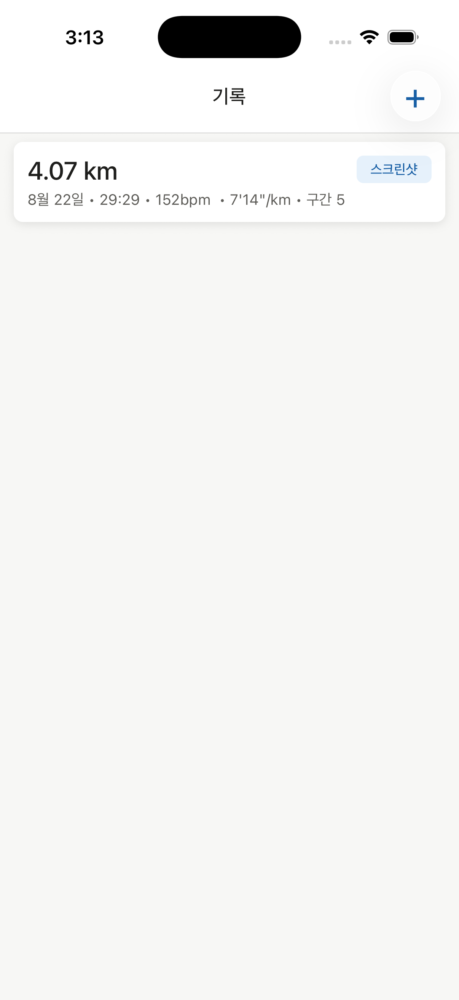
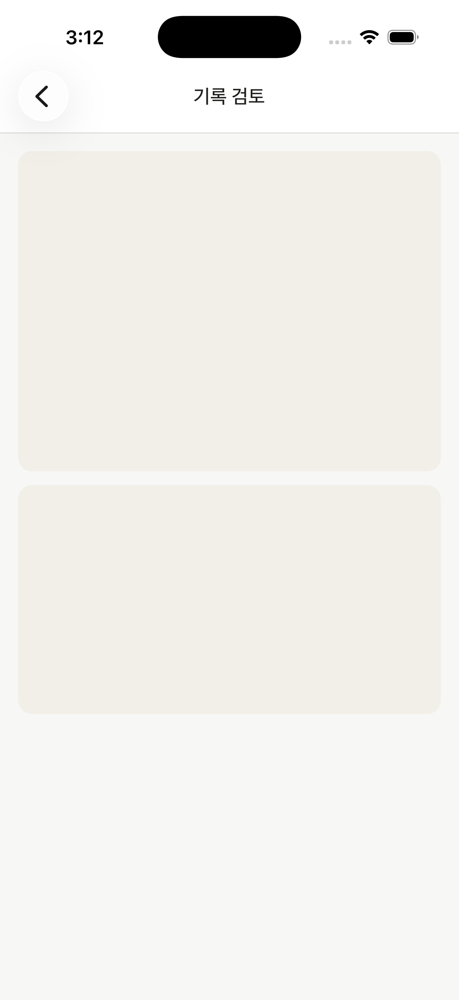
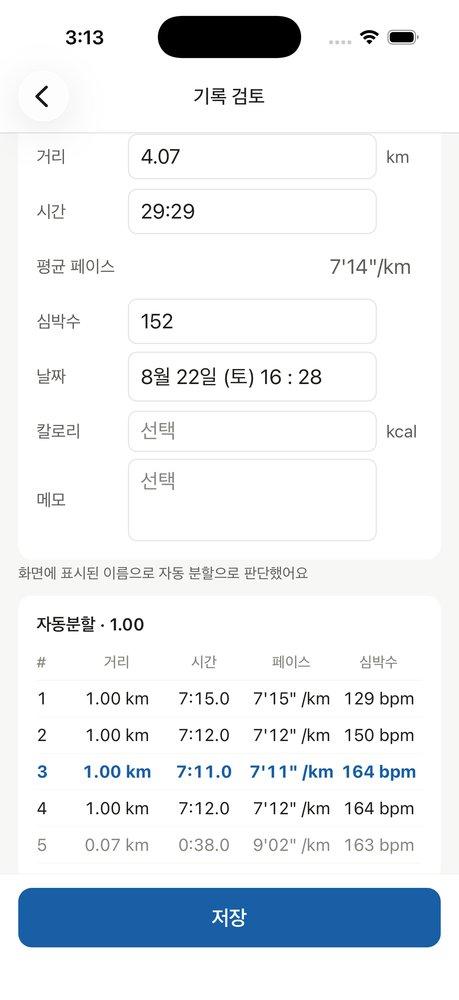
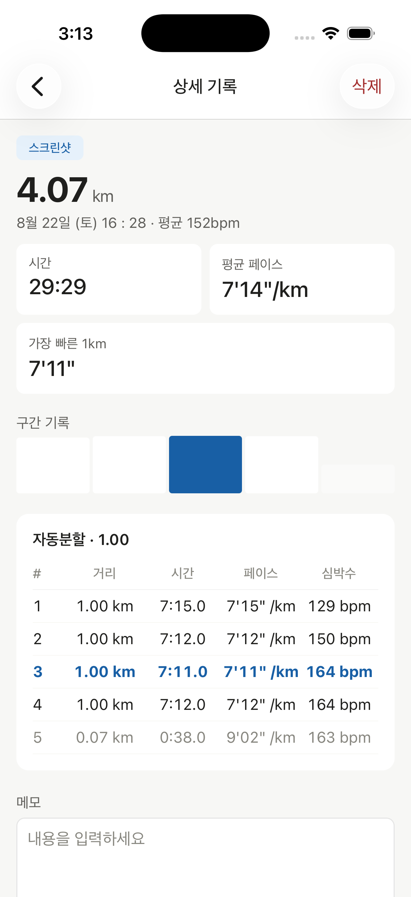
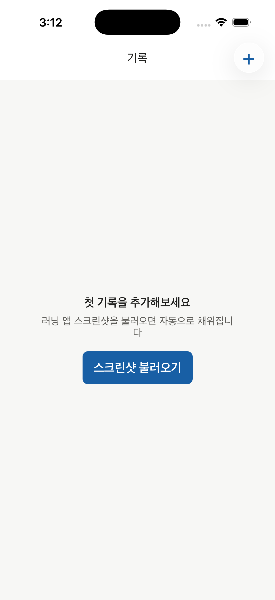
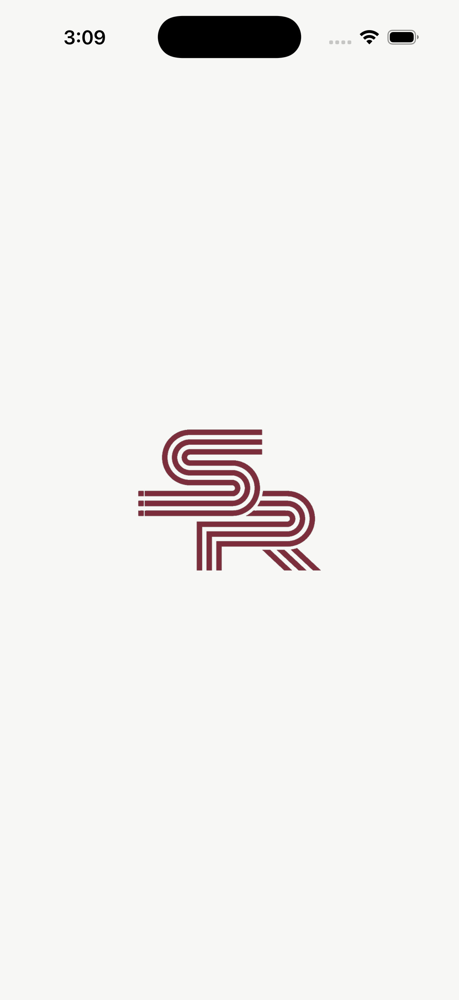

# StartRun

여러 러닝 앱에 흩어진 기록을 스크린샷 한 장으로 모으는 러닝 기록 앱입니다.

지금 쓰는 러닝 앱, 예전에 쓰던 러닝 앱, GPS 워치 앱까지 — 기록이 여기저기 흩어져 있는 문제에서 출발했습니다. 결과 화면을 스크린샷으로 찍기만 하면 거리·시간·심박수·구간 기록까지 AI가 읽어서 채워줍니다.

## 스크린샷

<table>
  <tr>
    <td align="center"><br>기록 목록</td>
    <td align="center"><br>추출 중</td>
    <td align="center"><br>기록 검토</td>
  </tr>
  <tr>
    <td align="center"><br>기록 상세</td>
    <td align="center"><br>빈 상태</td>
    <td align="center"><br>스플래시</td>
  </tr>
</table>

## 어떻게 동작하는가

1. 러닝 앱 결과 화면을 스크린샷으로 찍습니다. 여러 장을 한 번에 골라도 됩니다 (요약 화면과 구간표 화면이 따로여도 하나의 기록으로 합쳐 인식합니다).
2. 이미지를 Supabase Edge Function을 거쳐 Claude(Sonnet 5)의 비전 기능으로 보내, 거리·시간·심박수·구간 기록을 구조화된 JSON으로 추출합니다.
3. 검토 화면에서 추출 결과를 확인·수정한 뒤 저장합니다. AI 추출을 그대로 믿지 않고 항상 사용자가 확인하는 단계를 거칩니다.

## 주요 기능

- 스크린샷 기반 자동 기록 추출 (Claude Vision + JSON Schema)
- 자동 분할(split)과 사용자 랩(lap) 구분 인식 — 판단할 수 없으면 랩으로 폴백하고 경고 배너로 알림
- 자투리 구간 자동 판별, 페이스는 저장하지 않고 항상 거리·시간에서 파생 계산
- 구간별 페이스 편차를 보여주는 막대 그래프
- 주간 요약 스트립
- 다크모드 지원
- 로컬 SQLite 저장 (오프라인에서도 목록·상세 조회 가능)

## 기술 스택

- **App**: React Native 0.86 (bare) + TypeScript
- **Navigation**: React Navigation (native-stack)
- **State**: TanStack Query, Zustand
- **Storage**: op-sqlite (로컬), Supabase (추출 파이프라인)
- **AI 추출**: Supabase Edge Function (Deno) + Claude API
- **Test**: Jest + ts-jest

## 아키텍처

Clean Architecture를 feature 단위로 적용했습니다.

```text
src/
├─ app/                 # 네비게이션, 테마, 전역 프로바이더
├─ core/                # DB 어댑터, 공통 유틸, 공통 UI
└─ features/
   ├─ activity/          # 기록 목록·상세
   └─ ai-import/         # 스크린샷 추출·검토
```

각 feature는 `domain`(엔티티·유스케이스) ← `data`(리포지토리·매퍼) / `presentation`(화면·컴포넌트)으로 나뉩니다. `domain`은 SQLite도 Claude API도 알지 못하며, 의존성은 항상 `presentation → domain ← data` 방향입니다.

## 설계 결정

- **페이스·자투리 여부는 저장하지 않습니다.** 거리를 수정하면 저장된 값이 실제와 어긋나기 때문에, 항상 거리·시간에서 파생 계산합니다.
- **구간 종류를 판단할 수 없어도 저장을 막지 않습니다.** 랩으로 폴백하고 경고 배너로 알립니다. 랩은 균일성이나 자투리를 주장하지 않는 타입이라 잘못 골라도 안전하고, 매번 사용자에게 판단을 떠넘기는 것보다 낫다고 판단했습니다.
- **검토 없이 저장하는 경로는 만들지 않았습니다.** 스크린샷 인식 정확도는 러닝 앱마다 다르므로, 저장 전에는 항상 사용자가 확인합니다.

## 시작하기

### 요구 사항

- Node ≥ 22.11
- iOS: Xcode + CocoaPods
- Android: Android Studio

### 설치

```bash
npm install

# iOS
bundle install
bundle exec pod install --project-directory=ios
```

### 실행

```bash
npm start

# 새 터미널에서
npm run ios
npm run android
```

### AI 추출 기능

스크린샷 추출은 Supabase Edge Function을 거쳐 Claude API를 호출합니다. 직접 배포하려면:

```bash
supabase functions deploy extract-activity
supabase secrets set ANTHROPIC_APIKEY=sk-ant-...
```

`src/core/config/supabase.ts`의 `SUPABASE_URL` / `SUPABASE_PUBLISHABLE_KEY`를 본인 프로젝트 값으로 바꿉니다. publishable key는 클라이언트에 노출되는 것을 전제로 설계된 키라 커밋해도 안전하지만, 호출마다 Claude API 비용이 발생하므로 Anthropic 콘솔에서 월 지출 한도를 걸어두는 것을 권장합니다.

### 테스트

```bash
npm test
```

구간 판별·페이스 계산 같은 도메인 로직, 매퍼, DB 마이그레이션을 Node 환경에서 검증합니다. 화면 동작은 시뮬레이터에서 직접 확인합니다.
